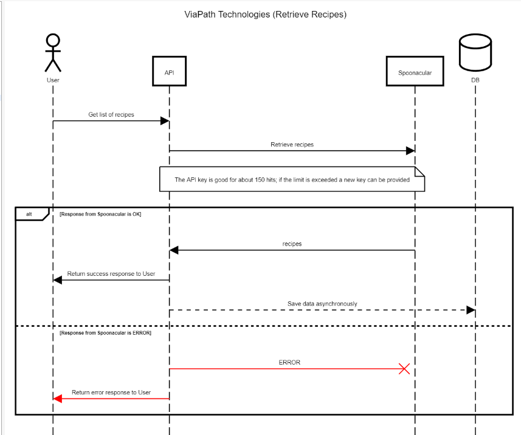
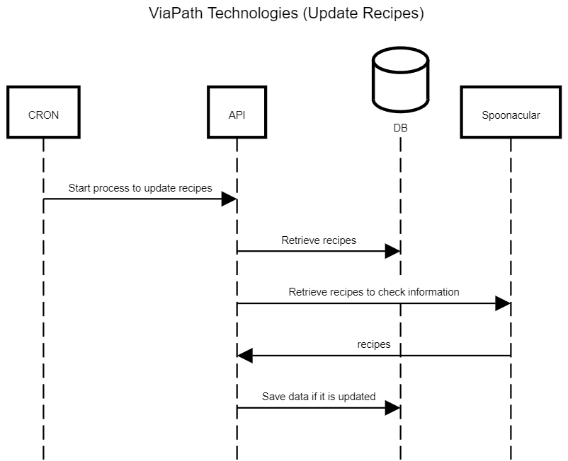
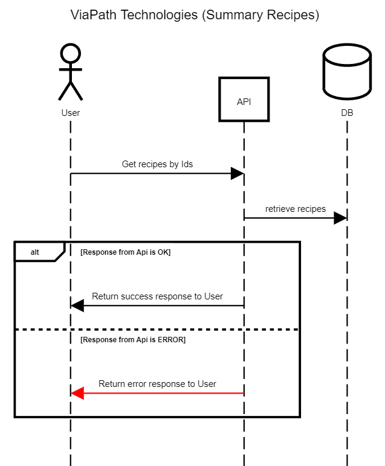
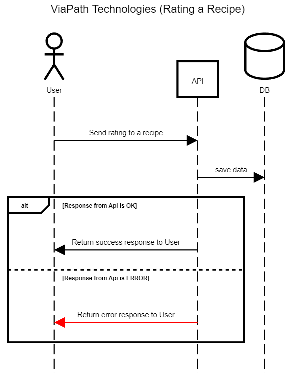
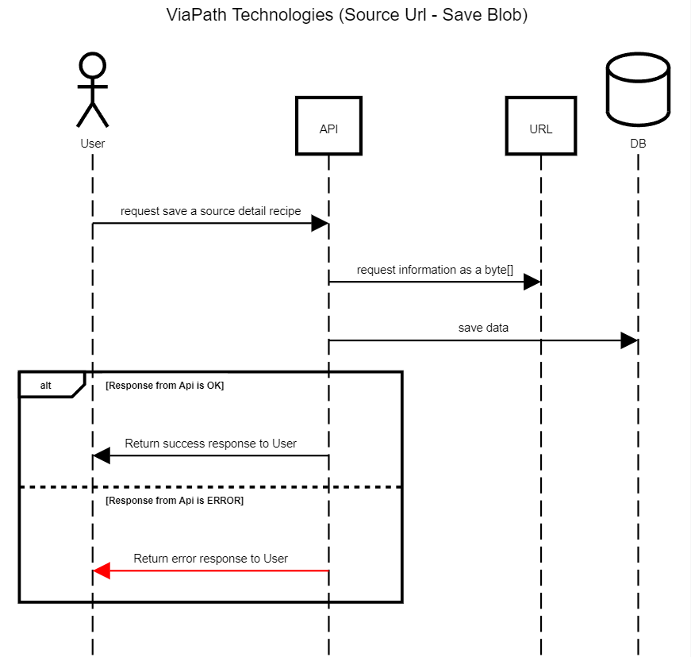

# Viapath Project
This readme provides an overview of the "Viapath" project.
The "Viapath" project is an application that uses Spring Boot to interact with an external recipe API,
stores recipe data in a PostgreSQL database, and performs periodic updates on recipes to keep the database up to date.

## Table of Contents

- [Requirements](#requirements)
- [Installation](#installation)
- [Diagrams](#diagrams)
- [Collection](#collection)
- [API_Documentation](#api_documentation)

## Requirements

Ensure you have the following prerequisites installed on your system:

- Java 17
- Gradle
- Docker
- Git

## Installation

1. Clone https://github.com/ceguro/viapath.git
2. Use your favorite IDE

## Diagrams:

# Collection
[Download Collection](https://github.com/ceguro/viapath/blob/main/collection/collection_insomnia)

# API_Documentation
You can find the API documentation at [http://localhost:9595/swagger-ui.html](http://localhost:9595/swagger-ui/index.html), which uses Swagger/OpenAPI to facilitate interaction and understanding of the available endpoints.
